# Purpose

This folder is my suggested solution to the Fin Metrics Exam that
consists of six questions.

# Question 1 - Yield Spreads

## Introduction

It was pointed out by economists that current yield spreads in local mid
to longer dated bond yields have been historically high. Yield spreads
between bonds of different maturities reflect how investors view the
economic conditions. For example, widening spreads indicate largely
different views between short to long term, and illustrates a view of
better long term conditions than present.

The price of a bond moves inversely to its yield, therefore a riskier
bond is cheaper in price but greater in yield. Yield spreads are an
indication of market sentiment. Relevant to the South African case, if
investors are risk averse, they favor safer bonds, and therefore the
spread between developed market bonds and emerging market bonds widen.

Furthermore, yield differentials between bonds of the same class but
with different maturities are also helpful indicators of sentiment.
Longer-dated debt usually is considered riskier than short-dated debt,
owing to the maturity risk premium. So, long-term debt typically would
have a positive yield spread relative to short-term debt. But, at
turning points in the market cycle, when a recession is priced in and
fear of the immediate future prevails, investors shun shorter-term debt
in favor of longer-term debt, thus pushing up short-term yields and
dampening long-term yields.

In this paper, I review these avenues to investigate the
higher-than-usual yield spreads in South Africa.

## Historical Overview

The first plot below shows the historical view of yields from 1999 to
2021, whilst the second plot shows the historical view of yield spreads
over the same period in South Africa. The bond yields included are the
3-month, 2-year and 10-year government bonds.

The first plot shows an increasing spike in the 10-year yield from the
end of 2019 or start of 2020. Increasing yields during the period of
Covid-19 is expected for a few reasons. There is a global risk of
sentiment, so investors move out of EME bonds, this reduces bond prices
and increase the yields. Secondly, the bonds are more risky as treasury
embarked implemented fiscal stimulus amid already existing high debt
levels. The 3-month bond and 2 year bond yields decrease over the same
period as the SARB implement interest rate cuts and for the first time,
intervene along the yield curve with some sense of quantatitive easing.

The second plot shows that current yield spreads are higher than the
historical yield spreads. The yield spreads spike at the end of 2019 or
start of 2020, and stabilise at high levels. The spread between the
10-year and 3 month bonds are the greatest, followed by the difference
between the 10 year and 2 year, and then the 2 year and 3 month. As
shown in the first plot, the 10-year yield spiked upwards, while the
3-month and 2-year fall dramatically downwards. This causes the initial
spike upwards that one observes in the yield spreads where the 10-year
bond is involved, while the spread between the 3-month and 2-year is
more tame. In order to understand this better, I review want to get an
idea of the international investor sentiment.

``` r
SA_bond_calc_1 <- SA_bonds %>% arrange(date) %>% gather(rate_type, rate, -date) %>%
ggplot() +
geom_line(aes(date, rate, colour = rate_type), size = 1.1, alpha = 0.8) +
fmxdat::theme_fmx() +
labs(x = "Date", y = "Yields", title = "Yields in South Africa", subtitle = "Historical view of yield spreads in South Africa, 1999 to 2021") 
SA_bond_calc_1
```

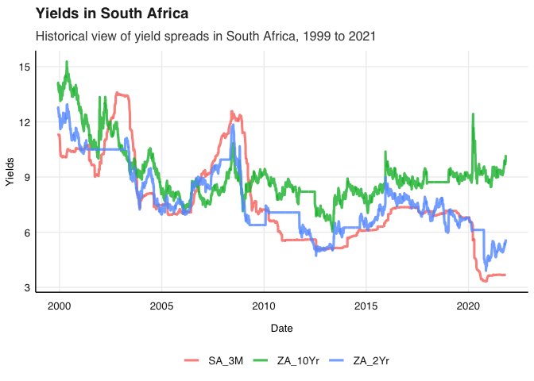

``` r
SA_bond_calc <- SA_bonds %>% arrange(date) %>% mutate(YS_10Yr_3M = ZA_10Yr - SA_3M) %>%
mutate(YS_10Yr_2Yr = ZA_10Yr - ZA_2Yr) %>%
mutate(YS_2yr_3M = ZA_2Yr - SA_3M) %>%
select(-SA_3M, -ZA_10Yr, -ZA_2Yr) %>%
gather(rate_type, rate, -date)

g <- SA_bond_calc %>%  ggplot() +
geom_line(aes(date, rate, colour = rate_type), size = 1.1, alpha = 0.8) +
fmxdat::theme_fmx() +
labs(x = "Date", y = "Yield Spreads", title = "Yield Spreads in South Africa", subtitle = "Historical view of yield spreads in South Africa, 1999 to 2021", caption = "Spreads are calculated as longer period less shorter period.")
g
```

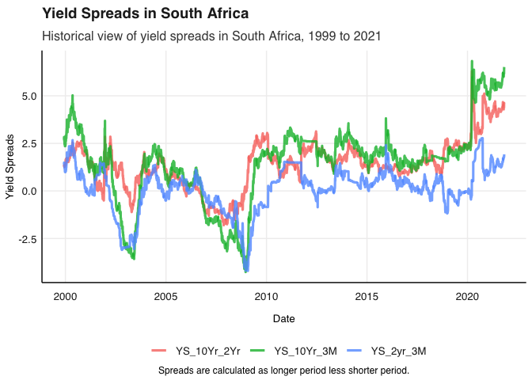

## International Sentiment

Firstly, I plot the USD/ZAR exchange rate to obtain an idea of
volatility in carry trade and capital outflows. This figure shows a
large spike in the exchange rate to levels above R18 per dollar. This is
an indication of substantial capital outlflow out of South Africa. This
is anecdotal evidence to expect that demand for SA bonds decreased
largely by international investors. I argue that the reason we do not
observe this as in the 3-month or 2-year is because of the substantial
SARB intervention.

``` r
usdzar <- usdzar %>%  filter(date > lubridate::ymd(20180101))
names(usdzar)[3] <- 'USDZAR'
p <- usdzar %>% select (-Name) %>%
ggplot() +
geom_line(aes(date, USDZAR), color = "steelblue", size = 1.1, alpha = 0.8)
p
```

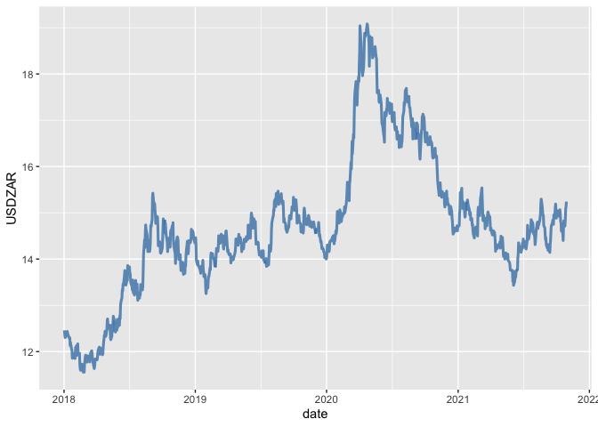

To confirm this finding, I compare the yield spread between the SA and
US 10-year bonds, and the yield spread between the SA and US 2-year
bonds. Fedderke (2021) argue that higher South African economic growth,
lower inflation, public and private debt, as well as Rand-Dollar
appreciation are all associated with a statistically significantly lower
South African - United States yield spread. In addition to that, I would
add global risk sentiment as contributing to yield spread evolution
between SA and the US.

The figure shows a clear spike in the yield spread between the US and
SA. The spread is calculated as the SA yield less the US yield. This
confirms that global risk sentiment, movement out of emerging market
bonds and into safer developed markets bond is a contributing factor to
higher yields in South Africa. In addition to this, I have omitted an
discussion of an important factor being inflation. Investors are
concerned about real yields, and therefore, if inflation expectations
increase, then investors demand higher nominal yields to ensure constant
real yields. Initially, there was a fear of deflation in the US, but
this fear became less apparent as fiscal and monetary policy makers
adopted great expansionary policy.

``` r
US_10yr <- bonds_10yr %>% group_by(Name) %>% filter(Name == "US_10Yr") %>% ungroup() %>% select(-Name)
names(US_10yr)[2] <- 'US_10Yr'
US_2yr <- bonds_2yr %>% group_by(Name) %>% filter(Name == "US_2yr") %>% ungroup() %>% select(-Name)
names(US_2yr)[2] <- 'US_2Yr'

# I want to compare SA yield to USA yield for maturities available. 

US_Yields <- left_join(US_10yr, US_2yr, by = "date")
SA_Yields <- SA_bonds %>% select(-SA_3M)
Combined_Yields <- left_join(US_Yields, SA_Yields, by = "date") %>% filter(date > lubridate::ymd(20000101))

Combined_Spreads <- Combined_Yields %>% mutate(ZA_US_10Yr = ZA_10Yr - US_10Yr) %>%
mutate(ZA_US_2Yr = ZA_2Yr - US_2Yr) %>%  select(date, ZA_US_10Yr, ZA_US_2Yr) %>%
gather(Spread_Type, Spread, -date) %>% 
ggplot() +
geom_line(aes(date, Spread, colour = Spread_Type), size = 1.1, alpha = 0.8) +
fmxdat::theme_fmx() +
labs(x = "date", y = "Yield Spread", title = "Yield Spreads between South African and US Bonds", subtitle = "Historical view of yield spreads between South Africa and the USA, 2000 to 2021", caption = "Spreads are calculated as SA yield less USA yield.") 

Combined_Spreads
```

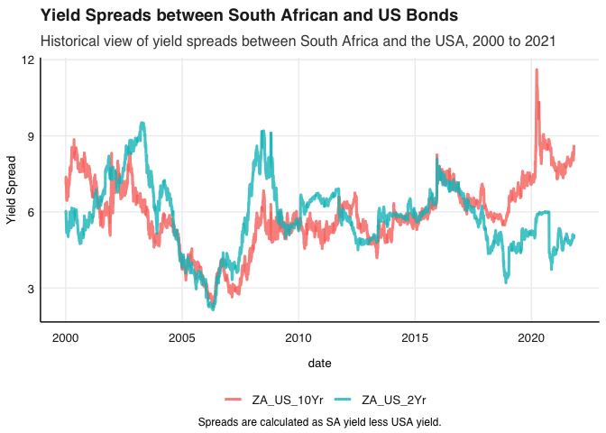

## Conclusion

My main line of argument is that capital outflows into safer developed
market bonds caused the demand for South African bonds to decrease, and
therefore their yields to increase. I argue that the substantial action
by the SARB, especially its adoption of a mild form quantative easing
for the first time, kept the 3-month and 2-year yields low. However, the
10-year yield increased, and in turn its spread with bonds of shorter
maturity. Higher yields for expected for longer-term bonds, but I do
agree with the initial hypothesis that the yield spreads are greater
than historical norms.

## References

Fedderke, J.W., 2021. The South African–United States sovereign bond
spread and its association with macroeconomic fundamentals. South
African Journal of Economics.

# Question 2 - SWIX and ALSI comparison

## Introduction

This reports compares the ALSI (J200) and the SWIX (J400) top 40
Indexes. Both indexes operate consist of the 40 most investable
companies in the ALSI universe, and both operate an free float market
cap weighting methodlogy. The key distinction between the two indices is
that the SWIX differs by using the STRATE (South Africa’s Central
Securities Depository) share register to reduce constituent weights of
foreign or inward-listed companies. The SWIX indices are therefore
intended to be an indication of the shares held locally.

The constituents of the SWIX 40 will be selected using SWIX-adjusted
market capitalisation, and therefore the constituents of the SWIX 40 may
differ from those of the ALSI Top 40 index. Investors have raised
concerns about the high level of concentration of individual securities
within the indices. This raises a discussion of capping individual
securities to allow investors greater exposure to the rest of the
market. This report investigates the differences between the two
indexes.

## Overall Comparison between SWIX and ALSI Top 40

The two Top 40 indexes are largely similar with small differences. The
figure below compares their historical performance, and it is clear to
see how synchronous the two indexes are.

``` r
# Data Wrangling 

# Compare overall performance of SWIX and ALSI

R_xts <- T40 %>% select(-Short.Name, -Sector, -Index_Name, -J400, -J200) %>%
tbl_xts(., cols_to_xts = Return, spread_by = Tickers)

J200_W_xts <- T40 %>% select(-Short.Name, -Sector, -Index_Name, -J400, -Return) %>%
tbl_xts(., cols_to_xts = J200, spread_by = Tickers)

J400_W_xts <- T40 %>% select(-Short.Name, -Sector, -Index_Name, -J200, -Return) %>%
tbl_xts(., cols_to_xts = J400, spread_by = Tickers)

# Set all NA returns to zero:
R_xts[is.na(R_xts)] <- 0
J400_W_xts[is.na(J400_W_xts)] <- 0
J200_W_xts[is.na(J200_W_xts)] <- 0

J200_Portfolio <- rmsfuns::Safe_Return.portfolio(R = R_xts, weights = J200_W_xts, geometric = TRUE)
J400_Portfolio <- rmsfuns::Safe_Return.portfolio(R = R_xts, weights = J400_W_xts, geometric = TRUE)

J200_Portf_Rets <- J200_Portfolio$portfolio.returns %>% xts_tbl() %>% mutate(J200_Cum_Ret = cumprod(1+portfolio.returns))

J400_Portf_Rets <- J400_Portfolio$portfolio.returns %>% xts_tbl() %>% mutate(J400_Cum_Ret = cumprod(1+portfolio.returns))

port_compare <- left_join(J200_Portf_Rets, J400_Portf_Rets, by = "date") %>% select(date, J200_Cum_Ret, J400_Cum_Ret) %>%
gather(Index, Return, -date) 

plot_port <- port_compare %>%  ggplot() + geom_line(aes(date, Return, color = Index)) + theme_bw() +
fmxdat::fmx_cols() +
fmxdat::theme_fmx(title.size = ggpts(50), CustomCaption = F) +
labs(x = "Date", y = "Cumulative Returns", title = "J200 and J400 Cumulative Returns over time",
subtitle = "A comparison of the cumulative returns of the ALSI Top 40 and the SWIX Top 40 over time")

plot_port
```

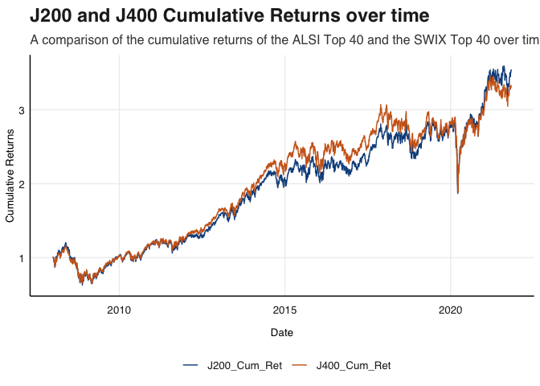

In order to investigate this a bit further, I present the following
figure showing the historic performance of the indexes’ allocation to
large caps using the exact weights as used by the index. As to be
expected from a top 40 index, the majority of allocation are to large
caps. If one compares the above figure to the figure below, under close
inspection, one can see that the magnitude of the y-axis is large in the
full version (above) relative to the large-cap version. Small caps,
intuitively, do not feature in top 40 indexes.

``` r
#### Compare overall performance over Large Caps ##########

LC_R_xts <- T40 %>% select(-Short.Name, -Sector, -J400, -J200) %>% filter(Index_Name == "Large_Caps") %>%
tbl_xts(., cols_to_xts = Return, spread_by = Tickers)

LC_J200_W_xts <- T40 %>% select(-Short.Name, -Sector, -J400, -Return) %>% filter(Index_Name == "Large_Caps") %>%
tbl_xts(., cols_to_xts = J200, spread_by = Tickers) 

LC_J400_W_xts <- T40 %>% select(-Short.Name, -Sector, -Sector, -J200, -Return) %>% filter(Index_Name == "Large_Caps") %>%
tbl_xts(., cols_to_xts = J400, spread_by = Tickers)

# Set all NA returns to zero:
LC_R_xts[is.na(LC_R_xts)] <- 0
LC_J400_W_xts[is.na(LC_J400_W_xts)] <- 0
LC_J200_W_xts[is.na(LC_J200_W_xts)] <- 0

LC_J200_Portfolio <- rmsfuns::Safe_Return.portfolio(R = LC_R_xts, weights = LC_J200_W_xts, geometric = TRUE)
LC_J400_Portfolio <- rmsfuns::Safe_Return.portfolio(R = LC_R_xts, weights = LC_J400_W_xts, geometric = TRUE)

LC_J200_Portf_Rets <- LC_J200_Portfolio$portfolio.returns %>% xts_tbl() %>% mutate(LC_J200_Cum_Ret = cumprod(1+portfolio.returns))

LC_J400_Portf_Rets <- LC_J400_Portfolio$portfolio.returns %>% xts_tbl() %>% mutate(LC_J400_Cum_Ret = cumprod(1+portfolio.returns))

LC_port_compare <- left_join(LC_J200_Portf_Rets, LC_J400_Portf_Rets, by = "date") %>% select(date, LC_J200_Cum_Ret, LC_J400_Cum_Ret) %>%
    gather(Index, Return, -date) 

LC_plot_port <- LC_port_compare %>%  ggplot() + geom_line(aes(date, Return, color = Index)) + theme_bw() +
    fmxdat::fmx_cols() +
    fmxdat::theme_fmx(title.size = ggpts(50), CustomCaption = F) +
    labs(x = "Date", y = "Cumulative Returns", title = "Large Caps J200 and J400 Cumulative Returns over time",
         subtitle = "A comparison of the cumulative returns of the Large Caps in the ALSI Top 40 and the SWIX Top 40 over time")
LC_plot_port
```

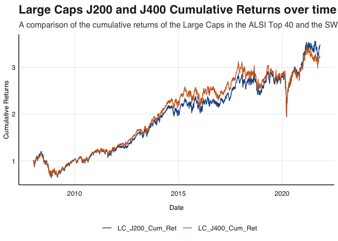

``` r
# fmxdat::finplot(LC_port_compare, x.vert = T, x.date.type = "%Y", x.date.dist = "1 years")
```

I turn to the medium-caps in order to draw a more distinct comparison
between the two top 40 indexes. An interesting pattern emerges here, in
the previous two figures, the J200 outperforms the J400 in 2021
(cumulatively), but with the midcaps, the J400 outperforms the J200.
This could either be because the J400 has greatest exposure to midcaps
or has the same exposure, but includes better midcaps.

``` r
MC_R_xts <- T40 %>% select(-Short.Name, -Sector, -J400, -J200) %>% filter(Index_Name == "Mid_Caps") %>%
    tbl_xts(., cols_to_xts = Return, spread_by = Tickers)

MC_J200_W_xts <- T40 %>% select(-Short.Name, -Sector, -J400, -Return) %>% filter(Index_Name == "Mid_Caps") %>%
    tbl_xts(., cols_to_xts = J200, spread_by = Tickers) 

MC_J400_W_xts <- T40 %>% select(-Short.Name, -Sector, -Sector, -J200, -Return) %>% filter(Index_Name == "Mid_Caps") %>%
    tbl_xts(., cols_to_xts = J400, spread_by = Tickers)

# Set all NA returns to zero:
MC_R_xts[is.na(MC_R_xts)] <- 0
MC_J400_W_xts[is.na(MC_J400_W_xts)] <- 0
MC_J200_W_xts[is.na(MC_J200_W_xts)] <- 0

MC_J200_Portfolio <- rmsfuns::Safe_Return.portfolio(R = MC_R_xts, weights = MC_J200_W_xts, geometric = TRUE)
MC_J400_Portfolio <- rmsfuns::Safe_Return.portfolio(R = MC_R_xts, weights = MC_J400_W_xts, geometric = TRUE)

MC_J200_Portf_Rets <- MC_J200_Portfolio$portfolio.returns %>% xts_tbl() %>% mutate(MC_J200_Cum_Ret = cumprod(1+portfolio.returns))

MC_J400_Portf_Rets <- MC_J400_Portfolio$portfolio.returns %>% xts_tbl() %>% mutate(MC_J400_Cum_Ret = cumprod(1+portfolio.returns))

MC_port_compare <- left_join(MC_J200_Portf_Rets, MC_J400_Portf_Rets, by = "date") %>% select(date, MC_J200_Cum_Ret, MC_J400_Cum_Ret) %>%
gather(Index, Return, -date) 

MC_plot_port <- MC_port_compare %>%  ggplot() + geom_line(aes(date, Return, color = Index)) + theme_bw() +
    fmxdat::fmx_cols() +
    fmxdat::theme_fmx(title.size = ggpts(50), CustomCaption = F) +
    labs(x = "Date", y = "Cumulative Returns", title = "Mid Caps J200 and J400 Cumulative Returns over time",
         subtitle = "A comparison of the cumulative returns of the Mid Caps in the ALSI Top 40 and the SWIX Top 40 over time")
MC_plot_port
```

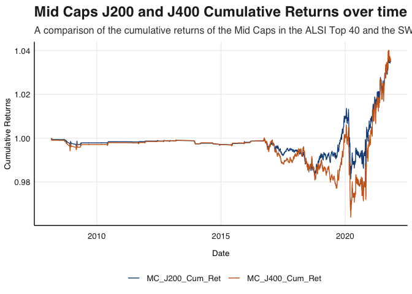

## Volatility

I present a simple calculation about volatility that each indix
experiences in times where the USD/ZAR has high or low volatility. I
measure the standard deviation of the USD/ZAR, classify periods within
above the 80th percentile of standard deviation as high volatility, and
below the 20th percentile as low volatility. The results are as follows.

``` r
library(kableExtra)
```

    ## 
    ## Attaching package: 'kableExtra'

    ## The following object is masked from 'package:dplyr':
    ## 
    ##     group_rows

``` r
# Volatile USDZAR 
zar <- read_rds("data/usdzar.rds")

ZARSD <- zar %>% filter(date > ymd(20080102)) %>%
mutate(YearMonth = format(date,"%Y%B")) %>% group_by(YearMonth) %>% summarise(SD = sd(Price)*sqrt(52)) %>%
mutate(TopQtile = quantile(SD, 0.8), BotQtile = quantile(SD,0.2))

Hi_Vol <- ZARSD %>% filter(SD >TopQtile) %>% pull(YearMonth)
Low_Vol <- ZARSD %>% filter(SD < BotQtile) %>% pull (YearMonth)

## Who has better vol? 

overall_SD <- port_compare %>% mutate(YearMonth = format(date,"%Y%B")) %>% group_by(Index) %>%
summarise(Full_SD = sd(Return)*sqrt(252))

high_vol_SD <- port_compare %>% mutate(YearMonth = format(date,"%Y%B")) %>%
filter(YearMonth %in% Hi_Vol)%>% group_by(Index) %>%
summarise(Highvol_SD = sd(Return)*sqrt(252))
    
Low_vol_SD <- port_compare %>% mutate(YearMonth = format(date,"%Y%B")) %>%
filter(YearMonth %in% Low_Vol)%>% group_by(Index) %>%
summarise(Lowvol_SD = sd(Return)*sqrt(252))


vol_compare_demo <- left_join(overall_SD, high_vol_SD, by = "Index")

vol_compare <- left_join(vol_compare_demo, Low_vol_SD, by = "Index") %>%
mutate(high_SD_ratio = Highvol_SD/Full_SD, low_SD_Ratio = Lowvol_SD/Full_SD) %>% kable()
vol_compare
```

<table>
<thead>
<tr>
<th style="text-align:left;">
Index
</th>
<th style="text-align:right;">
Full_SD
</th>
<th style="text-align:right;">
Highvol_SD
</th>
<th style="text-align:right;">
Lowvol_SD
</th>
<th style="text-align:right;">
high_SD_ratio
</th>
<th style="text-align:right;">
low_SD_Ratio
</th>
</tr>
</thead>
<tbody>
<tr>
<td style="text-align:left;">
J200_Cum_Ret
</td>
<td style="text-align:right;">
11.99475
</td>
<td style="text-align:right;">
11.94102
</td>
<td style="text-align:right;">
7.531447
</td>
<td style="text-align:right;">
0.9955205
</td>
<td style="text-align:right;">
0.6278953
</td>
</tr>
<tr>
<td style="text-align:left;">
J400_Cum_Ret
</td>
<td style="text-align:right;">
12.30481
</td>
<td style="text-align:right;">
12.15909
</td>
<td style="text-align:right;">
8.303273
</td>
<td style="text-align:right;">
0.9881573
</td>
<td style="text-align:right;">
0.6747989
</td>
</tr>
</tbody>
</table>

The calculation shows that the standard deviation (SD) of the J200 is
slightly less than the J400 in the full sample period. Furthermore, the
SD of the J200 is lower than that of the J400 in high and low volatility
times. However, if one compares the ratios, high volatility SD divided
by full SD for example, one sees that the J200 has a greater ratio than
the J400 in high volatility times and a lower ratio in low volatility
times. In a sense, this means SD can change faster but within a smaller
bound.

## Conclusion

The two indexes are very similar, however it is known that the SWIX
focuses more on holding securities that mimic local holdings as opposed
to foreign holdings.

# Question 3 - PCA Analysis of the J200 Top 40

## PCA Application to J200

I start by doing some data wrangling. I construct a simple-weighted
return per day using the weights of the index. This seemed intuitive to
me as converting from daily simple returns to log returns was
challenging without exact price data. I mean-centre the data and convert
it to a wide format. The code for the wrangling is below.

``` r
T40_use <- T40 %>% select(-J400, -Short.Name, -Sector, -Index_Name) %>%
mutate(Tickers =gsub(" SJ Equity", "", Tickers)) %>%
rename(Weights = J200) %>% mutate(WRet = Weights*Return) %>%
select(-Weights, - Return) %>% rename(return = WRet) %>%
group_by(Tickers) %>%
mutate(return = return - mean(return)) %>% ungroup()

return_mat <- T40_use %>% spread(Tickers, return)

# I have calculated a weighted simple return per day. 
```

Next, I use Nico’s function to impute values to replace NAs. I tried to
source this from my code folder but ran into an error, so I do this
manually.

``` r
impute_missing_returns <- function(return_mat, impute_returns_method = "NONE",
Seed = 1234){
# Make sure we have a date column called date:
if( !"date" %in% colnames(return_mat) ) stop("No 'date' column
provided in return_mat. Try again please.")

# Note my use of 'any' below...
# Also note that I 'return' return_mat - which stops the function and returns return_mat.
if( impute_returns_method %in% c("NONE", "None", "none") ) {
if( any(is.na(return_mat)) ) warning("There are missing values in the return matrix
Consider maybe using impute_returns_method =
'Drawn_Distribution_Own' / 'Drawn_Distribution_Collective'")
return(return_mat)
}

if( impute_returns_method  == "Average") {
return_mat <-
return_mat %>% gather(Stocks, Returns, -date) %>%
group_by(date) %>%
mutate(Avg = mean(Returns, na.rm=T)) %>%
mutate(Avg = coalesce(Avg, 0)) %>%
ungroup() %>%
mutate(Returns = coalesce(Returns, Avg)) %>% select(-Avg) %>%
spread(Stocks, Returns)

    } else

if( impute_returns_method  == "Drawn_Distribution_Own") {

set.seed(Seed)
N <- nrow(return_mat)
return_mat <- left_join(return_mat %>% gather(Stocks, Returns, -date),
return_mat %>% gather(Stocks, Returns, -date) %>% group_by(Stocks) %>%
do(Dens = density(.$Returns, na.rm=T)) %>%
ungroup() %>% group_by(Stocks) %>% # done to avoid warning.
do(Random_Draws = sample(.$Dens[[1]]$x, N, replace = TRUE, prob=.$Dens[[1]]$y)),
by = "Stocks") %>%
group_by(Stocks) %>% mutate(Row = row_number()) %>%
mutate(Returns = coalesce(Returns, Random_Draws[[1]][Row])) %>%
select(-Random_Draws, -Row) %>% ungroup() %>% spread(Stocks, Returns)

        } else

if( impute_returns_method  == "Drawn_Distribution_Collective") {
set.seed(Seed)
NAll <- nrow(return_mat %>% gather(Stocks, Returns, -date))

return_mat <-
 bind_cols(
return_mat %>% gather(Stocks, Returns, -date),
return_mat %>% gather(Stocks, Returns, -date) %>%
do(Dens = density(.$Returns, na.rm=T)) %>%
do(Random_Draws = sample(.$Dens[[1]]$x, NAll, replace = TRUE,
prob=.$Dens[[1]]$y)) %>% unnest(Random_Draws)) %>%
mutate(Returns = coalesce(Returns, Random_Draws)) %>%
select(-Random_Draws) %>% spread(Stocks, Returns)

} else

if( impute_returns_method  == "Zero") {
warning("This is probably not the best idea but who am I to judge....")
                    return_mat[is.na(return_mat)] <- 0

} else
stop("Please provide a valid impute_returns_method method.
Options include:\n'Average', 'Drawn_Distribution_Own',
'Drawn_Distribution_Collective' and 'Zero'.")
}
```

Next, I turn to the PCA calculations. The challenge here is that the
constituents of the top 40 change over time. I calculate that over the
sample period there were 92 stocks in the top 40. My approach is to
include all 92 stocks, and then to see which PCAs drive these stocks
best. I argue this is intuitive because if a stock only featured in the
top40 for 1 year and never again, then it is unlikely that it will
explain most of the variation of the other stocks.

``` r
options(scipen = 999)
return_mat <- impute_missing_returns(return_mat,
impute_returns_method = "Drawn_Distribution_Collective",
Seed = as.numeric(format( Sys.time(), "%Y%d%H%M")))

# Drop date column for this...
return_mat_Nodate <- data.matrix(return_mat[, -1])

# METHODS
Sigma <- RiskPortfolios::covEstimation(return_mat_Nodate)
Mu <- RiskPortfolios::meanEstimation(return_mat_Nodate)

pca <- prcomp(return_mat_Nodate, center = TRUE, scale. = TRUE)
scree_1 <- fviz_screeplot(pca, ncp = 12)
scree_1
```

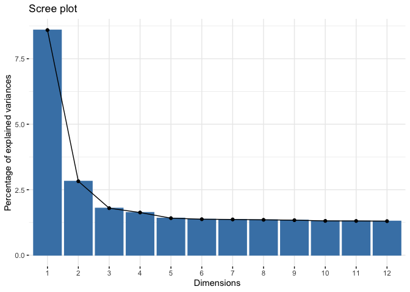

I see that the top 40 PCAs explain 58 percent of the variance of the 92
stocks. The scree plot above is the best visual illustration of the
contribution of the top 10 PCA factors to explaining the variation. The
top PCA factor explains 8,5 percent. In retrospect, a more focused
approach with fewer PCAs would be more intuitive.

## More Focused PCA

I take a snapshot of the top40 on the 1st of January 2020, and then I
use these 41 stocks (41, not 40), to create a PCA overtime. I implement
the exact procedure that I did in the previous PCA using Nico’s function
to impute missing values. My results show that I have 41 PCA factors,
where the 80 percent of the variation is explained using the best 25 PCA
factors and 50 percent of the variation is explained using the best 12
PCA factors.

The scree plot below shows that the

``` r
Top40_today <- T40 %>%
select(-J400, -Short.Name, -Sector, -Index_Name) %>%
mutate(Tickers =gsub(" SJ Equity", "", Tickers)) %>%
filter(date > ymd(20200101)) %>%
filter(date < ymd(20200103)) %>%
pull(Tickers)

T40_new <- read_rds("data/T40.rds") %>%
select(-J400, -Short.Name, -Sector, -Index_Name) %>%
mutate(Tickers =gsub(" SJ Equity", "", Tickers)) %>%
rename(Weights = J200) %>% mutate(WRet = Weights*Return) %>%
select(-Weights, - Return) %>% rename(return = WRet) %>% 
filter(Tickers %in% Top40_today) %>% group_by(Tickers) %>%
mutate(return = return - mean(return)) %>% ungroup()

return_mat_new <- T40_new %>% spread(Tickers, return)

return_mat_new <- impute_missing_returns(return_mat_new,
impute_returns_method = "Drawn_Distribution_Collective",
Seed = as.numeric(format( Sys.time(), "%Y%d%H%M")))

# Drop date column for this...
return_mat_new_Nodate <- data.matrix(return_mat_new[, -1])

# METHODS
Sigma <- RiskPortfolios::covEstimation(return_mat_Nodate)
Mu <- RiskPortfolios::meanEstimation(return_mat_Nodate)
# summary(pca_new)
pca_new <- prcomp(return_mat_new_Nodate, center = TRUE, scale. = TRUE)

scree_2 <- fviz_screeplot(pca_new, ncp = 12)
scree_2
```

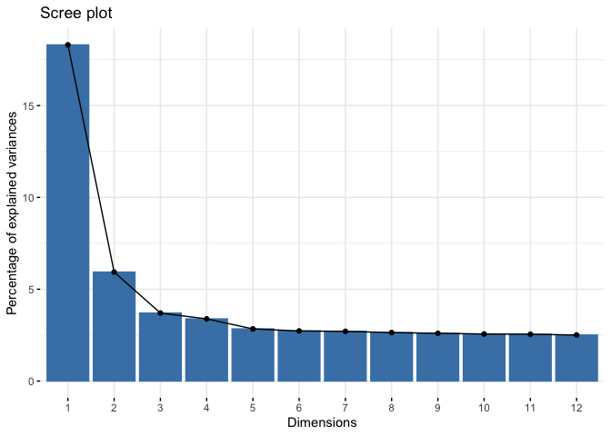

Lastly, the figure below shows how the individual stocks contribute to
the first PCA factor. This first PCA factor explains 18 percent of the
movement of the top 40 index as I have captured it. Interestingly, in
this PCA factor, one can see the largest contributors are SBK (Standard
Bank), FSR (FirstRand), NED (Nedbank), INL (Investec), ABG (Absa), INP
(Investec), SLM (Sanlam), and REM (Remgro). These are all part of
financials, and are mostly banks, except Remgro, Sanlam and parts of
Investec. This is an intuitive finding, because, if correlated
financials constitute a large part of the top 40, then using these as
PCA’s to explain the variation of the top 40.

``` r
fviz_contrib(pca_new, choice = "var", axes = 1) 
```

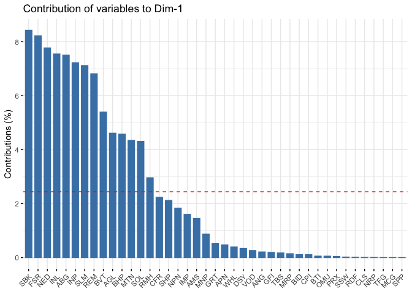

The following figure shows which stocks contribute to PCA 1 and PCA 2.
This is a visualization of the same argument that I made above. The
stocks drive largely in the same direction, North-East,

``` r
fviz_pca_var(pca_new, col.var = "contrib", repel = T) + theme_minimal()
```

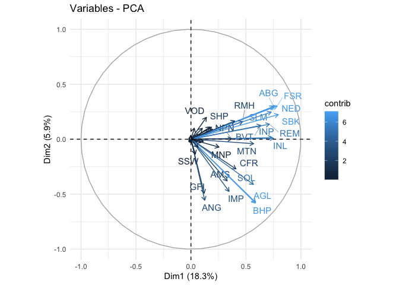

# Question 4 - An investigation of the USDZAR from numerous angles

## Overview of the investigation

The aim of this report is to comment on the following statements.
Firstly, the USDZAR has over the past few years been one of the most
volatile currencies. Secondly, the USDZAR has performed well during
periods where carry trades were favorable and currency valuations were
relatively cheap. Lastly, the ZAR benefits from a strong Dollar,
indicating a risk-on sentiment. The structure of the report follows in
three sections where each section is dedicated to tackling on the
statements.

## 1 - USDZAR volatility

This section investigates whether the ZAR has been one of the most
volatile currencies in recent years. I begin by consulting the Currency
Implied Volatility index which can be considered similar to the VIX
index but for currencies. The index uses put and call options to guage
the market’s forward implied volatility. A higher value indicates the
market foresees higher future volatility for a currency. I argue that
although this is not realised volatility, investors do take a position
regarding volatility in the market by using contracts. For visual ease,
I limit my investigation to larger EMEs and the UK and EU. The figure
shows South Africa (blue) experienced two large spikes in implied
volatility, firstly around 2002 and then around the GFC. But, besides
those two periods, the figure does not present anecdotal evidnce
suggesting that the USD/ZAR is more volatile recently, nor more volatile
than any other EME currency.

``` r
## ZAR is most volatile. I use the cncyIV, implied volatility.
# A higher value indicates the market foresees higher future volatility for a currency.
number_of_cncyIV <- cncyIV %>% group_by(date) %>% pull(Name) %>% unique()

cncyIV_use <- cncyIV %>% filter(Name %in% c("Brazil_IV", "EU_IV",
"UK_IV", "Turkey_IV", "Russia_IV", "India_IV", "SouthAfrica_IV")) %>%
filter(date > ymd(20000101)) %>% ggplot() +
geom_line(aes(x = date, y = Price, color = Name), size = 1, alpha = 0.8) +
fmxdat::fmx_cols() +
labs(x = "Date", title = "Implied Volatility of a chosen basket of currencies",
subtitle = "Higher value indicates greater expected volatility")
cncyIV_use
```

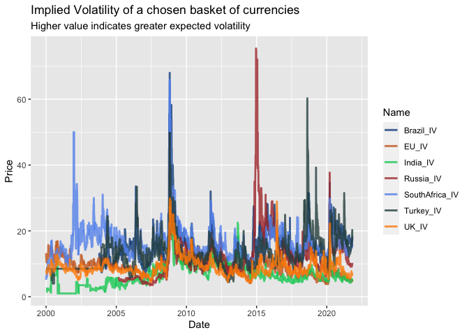

It is worth focusing specifically on USD/ZAR’s volatility. I construct a
figure below that compares a sample variance, rolling variance and
constant variance for the USD/ZAR. It seems the rolling variance does
the best job to isolate signal and noise, and it seems it has stabilised
in recent periods. Therefore, relevative to its own historical levels,
there is not increased volatility in the USD/ZAR. In this section one, I
have provided anecdotal evidence suggesting that the USD/ZAR has not
been one of the most volatile currencies, nor has it been more volatile
recently than periods before.

``` r
cncy_names <- cncy %>% group_by(date) %>% pull(Name) %>% unique()

cncy_SD <- cncy %>% filter(Name %in% c("SouthAfrica_Cncy")) %>%
mutate(across(.cols = Price, .fns = ~./lag(.)-1, .names = "Return")) %>%
select(-Price) %>%
arrange(date) %>% slice(-1) %>%
mutate(across(.cols = Return, .fns = ~sqrt(.^2), .names = "SampleSD"))

plot_cncy_SD <- cncy_SD %>% ggplot() + geom_line(aes(date, SampleSD))
back = 100
roll_plot <- cncy_SD %>% mutate(Constant_var = sd(Return)) %>%
mutate(Roller = roll_sd(Return, n = back, fill = NA)) %>%
ggplot() +
geom_line(aes(date, SampleSD), color = "steelblue") +
geom_hline(aes(date, yintercept = mean(Constant_var)), color = "red",
alpha = 0.8, size = 2) +
geom_line(aes(date, y = Roller), color = "darkgreen", alpha = 0.8,
size = 2) +
fmxdat::theme_fmx() +
labs(title = "Sample Var, Constant Var and Rolling Var of USD/ZAR",
caption = "Sample Var in blue, Constant Var in red and Rolling Var in Green",
x = "Date", y = "Standard Deviation")

roll_plot
```

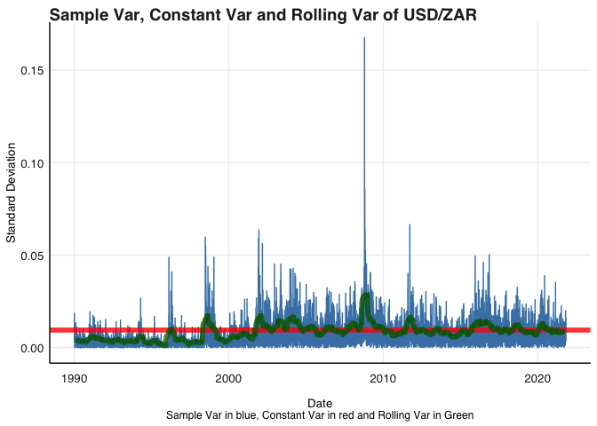

## 2 USDZAR with carry trade and an undervalued dollar

This section investigates whether the USD/ZAR performs well during
periods where carry trade is favorable, and during periods where
currency valuations are cheap. The code below is a lot of wrangling, but
the important figure that I produce compares all three factors
simultaneously. I use the Deutsche Bank G10 Harvest Index as the proxy
for the returns of a carry strategy. This index reflects the return of
being long the 3 high-yielding currencies against being short the 3
low-yielding currencies within the G10 currency universe. Therefore, an
increase in the return of the index represents favourable carry trade.
With the index, I construct quarterly log returns.

Secondly, I use the ZAR/USD prices, and similarly construct the
quarterly log returns. My understanding here is that positve returns
actually mean a depreciating ZAR. If increased carry trade means
increased capital inflows, and greater demand for rand (lower ZAR/USD),
then the two series are actually negatively correlated.

Lastly, I use the Deutsche Bank FX PPP Index as the proxy for the
returns of a value strategy. The FX PPP index reflects the return of
being long the 3 currencies with the highest rank (undervalued
currencies) against being short the 3 currencies with the lowest rank
(overvalued currencies) within G10 currency universe. Therefore, if
value is doing well then undervalued currencies have greater returns
than overvalued currencies. I show the figure below, and then continue
my discussion.

``` r
cncy_Carry_period_2 <- cncy_Carry %>%
select(-Name) %>% arrange(date) %>% mutate(day = weekdays(as.Date(date))) %>%
filter(day == "Monday") %>% select(-day) %>%
mutate(return = log(Price) - log(lag(Price))) %>% slice(-1) %>%
filter(date > ymd(20160601))

cncy_Carry_Price <- cncy_Carry %>%
select(-Name) %>% arrange(date) %>%
ggplot() + geom_line(aes(date, Price), color = "steelblue") +
fmxdat::theme_fmx() +
labs(title = "Carry Trade Returns",
subtitle = "Carry Trade Returns as shown by the Deutsche Bank G10 Harvest Index from 2000 to 2021",
x = "Date", y = "Carry Trade Index")

######

cncy_Carry_period <- cncy_Carry %>%
select(-Name) %>% arrange(date) %>% mutate(month = month(as.Date(date))) %>%
filter(month == c("1", "4", "7", "10")) %>% mutate(day = day(as.Date(date))) %>%
filter(day < 7) %>% slice(-23, -26, -32, -34) %>%
select(-day, -month) %>% mutate(return_carry = log(Price) - log(lag(Price))) %>%
slice(-1) %>% select(-Price)


### USD ZAR
cncy_Carry_period_dates <- cncy_Carry %>% select(-Name) %>%
arrange(date) %>% mutate(month = month(as.Date(date))) %>%
filter(month == c("1", "4", "7", "10")) %>% mutate(day = day(as.Date(date))) %>%
filter(day < 7) %>% slice(-23, -26, -32, -34) %>%
select(-day, -month) %>% pull(date)

cncy_plot <- cncy %>% filter(Name == "SouthAfrica_Cncy") %>%
select(-Name) %>% filter(date %in% cncy_Carry_period_dates) %>%
mutate(return_zar = log(Price) - log(lag(Price))) %>% slice(-1) %>% select(-Price)

combined_plot_1 <- left_join(cncy_Carry_period, cncy_plot, by = "date")

combined_plot_1_plot <- combined_plot_1 %>%
gather(type, return, -date) %>%
ggplot() + geom_line(aes(date, return, color = type)) +
fmxdat::theme_fmx() +
labs(title = "Carry Trade Returns and USD/ZAR returns",
subtitle = "Carry Trade Log Returns and USD/ZAR log returns",
x = "Date", y = "Log Returns")

# we expect them to invert if the hypothesis is true.

######### cheap currency valuations - combined this with above.

cncy_value <- cncy_value  %>% select(-Name) %>% arrange(date) %>%
filter(date %in% cncy_Carry_period_dates) %>%
mutate(return_value = log(Price) - log(lag(Price))) %>% slice(-1) %>% select(-Price)

three_combo_plot <- left_join(combined_plot_1, cncy_value , by = "date") %>%
gather(type, return, -date) %>%
ggplot() + geom_line(aes(date, return, color = type)) +
fmxdat::theme_fmx() +
labs(title = "Carry Trade Returns, USD/ZAR returns and Undervalued 
Currency Returns",
subtitle = "Carry Trade Log Returns, USD/ZAR log returns and log returns 
of the value index for currencies",
x = "Date", y = "Log Returns")

three_combo_plot
```

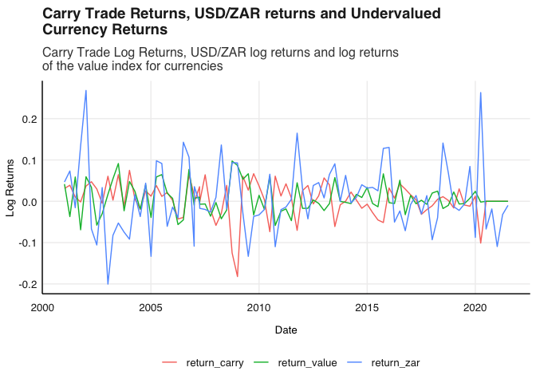 It is
apparent that the return on the ZAR mimics an inverted return on carry,
or rather show negative correlation. This is completely consistent with
economic literature concerning EME currencies as carry trade is a large
determinant of capital flows and exchange rate appreciation. Therefore,
as carry trade becomes favourable (red line increases), then the ZAR/USD
will decrease, generally. The return on value shows less amplitude and
more consisntency than the other series. I would not go as far to say
that the ZAR/USD strengthens when value is high generally, at least not
using my figure.

## 3 Benefits to the ZAR of a strong dollar

This section investigates whether the USD/ZAR performs better when the
dollar is stronger. In order to proxy for a strong dollar, I use the
Bloomberg Dollar Spot Index which tracks the performance of a basket of
10 leading global currencies versus the U.S. Dollar. My thinking is that
a strong dollar would be proxied by its levels relative to a basket of
10 other strategies to diversify away the effects of the
counter-currency causing the valuation differences. I combine this with
the USD/ZAR as we have used numerous times in this report. Again, I
consider quarterly log returns. I consider quarters, and not months, in
order to capture a longer period of time whilst preserving the ability
to interpret the line graphs. Secodnly, I want to isolate signal as
opposed to noise in capital flows, and I think that this is more likely
to be presented in quarterly returns than monthly or weekly.

``` r
bbdxy <- bbdxy %>% select(-Name) %>% arrange(date) %>%
filter(date %in% cncy_Carry_period_dates) %>% # I'm using this to indicate quarterly data. 
mutate(return_usd = log(Price) - log(lag(Price))) %>% slice(-1) %>% select(-Price)

usdzar <- cncy %>%
filter(Name == "SouthAfrica_Cncy") %>% select(-Name) %>%
filter(date %in% cncy_Carry_period_dates) %>%
mutate(return_zar = log(Price) - log(lag(Price))) %>%
slice(-1) %>% select(-Price)

combo_2 <- left_join(bbdxy, usdzar, by = "date")

plot_combo_2 <- combo_2 %>%
gather(type, return, -date) %>%
ggplot() + geom_line(aes(date, return, color = type)) +
fmxdat::theme_fmx() +
labs(title = "USD/ZAR returns and USD with a basket of currencies",
subtitle = "USDZAR relative to the strenght of the USD",
x = "Date", y = "Log Returns")

plot_combo_2
```

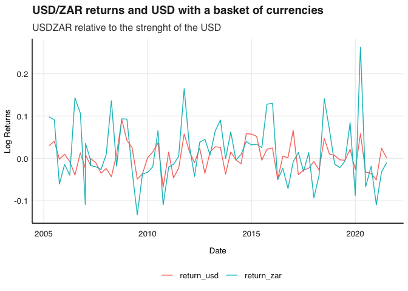

The figure above shows decent positive correlation for most periods.
This means that as the dollar strenghtens relative to the basket of 10,
then it strengthens relative to the ZAR, as well. This is seen as the
ZAR/USD increases, meaning the ZAr depreciates. Therefore, I disagree
that a strong dollar causes a strong rand, where a stronger rand is
somewhat representative of risk-off sentiment or capital inflows into
SOuth Africa.

# Question 5 - MSCI Funds

## Introduction

This report uses the return profiles of different asset classes to
investigate if diversification ability has decreased in the last decade.
The main methodology that I implement a DCC model allowing for
correlations between series to vary over time. I firstly obtain a GARCH
estimate of the univariate volatility of each series. I obtain
standardized residuals and use these to estimate the dynamic conditional
correlations. I rely largely on Nico’s notes for this report.

## Data Wrangling

I want to compare the dynamic correlations between different asset
classes to see to what extent one can diversify by holding different
asset classes. For this, I choose the following: MSCI_ACWI, MSCI_RE,
MSCI_USA, MSCI_USREIT and the BCom index. The asset classes include
commodities, equity and real estate. An extension to this report should
consider how to include bonds - I have not done so as it was not
immediately apparent to me if bond yields were sufficient to consider
bond correlations or if one needed bond prices as well.

``` r
###MSCI Setup
msci_names <- msci %>% pull(Name) %>% unique
msci_names_chosen <- c("MSCI_ACWI", "MSCI_RE", "MSCI_USA", "MSCI_USREIT")

msci_rtn <- msci %>% filter(date > ymd(20100101)) %>%
filter(Name %in% msci_names_chosen) %>%
arrange(date) %>% group_by(Name) %>%
mutate(dlogret = log(Price) - log(lag(Price))) %>%
mutate(scaled_ret = (dlogret - mean(dlogret, na.rm = T))) %>%
slice(-1, -2, -3, -4) %>%
select(-Price, -dlogret) %>% rename(return = scaled_ret) 

### Commodities Setup
comms_use <- comms %>% filter(date > lubridate::ymd(20100101)) %>%
arrange(date) %>% group_by(Name) %>% mutate(dlogret = log(Price) - log(lag(Price))) %>%
mutate(scaled_ret = (dlogret - mean(dlogret, na.rm = T))) %>% slice(-1, -2, -3) %>%
select(-Price, -dlogret) %>% rename(return = scaled_ret) %>% filter(Name == "Bcom_Index")

comms_wide <- comms_use %>% pivot_wider(names_from = Name, values_from = return)
msci_wide <- msci_rtn %>% pivot_wider(names_from = Name, values_from = return)
# I exclude oil and gold. 

bonds_names <- read_rds("data/bonds_10y.rds") %>% pull(Name) %>% unique
bonds <- read_rds("data/bonds_10y.rds") %>% filter(Name == "US_10Yr")

# Connect MSCI and Commodities
xts_rtn <- left_join(msci_wide, comms_wide, by = "date") %>%
gather(Name, Return, -date) %>% tbl_xts(.,cols_to_xts = "Return", spread_by = "Name")
```

## Implement GARCH model to find standardised residuals

First, I fit the univariate GARCH model to each of the series in the
dataframe. I pick a VAR order of zero for the mean equation, and simply
use the mean of the series. A GARCH(1,1) is run, this results in et and
sigmat, which I use the find the standardised residuals, zt. From the
figure below, it becomes clear that the asset classes are highly
correlated.

``` r
DCCPre <- dccPre(xts_rtn, include.mean = T, p = 0)
```

    ## Sample mean of the returns:  -0.0000009367445 -0.000002481525 -0.000002108653 -0.00000134006 
    ## Component:  1 
    ## Estimates:  0.000002 0.14844 0.833951 
    ## se.coef  :  0 0.016019 0.015944 
    ## t-value  :  5.398751 9.266337 52.30425 
    ## Component:  2 
    ## Estimates:  0.000002 0.123559 0.853896 
    ## se.coef  :  0 0.013887 0.015699 
    ## t-value  :  4.857149 8.897403 54.39276 
    ## Component:  3 
    ## Estimates:  0.000004 0.177412 0.78853 
    ## se.coef  :  0.000001 0.017059 0.017015 
    ## t-value  :  7.397643 10.39995 46.34402 
    ## Component:  4 
    ## Estimates:  0.000001 0.049674 0.939936 
    ## se.coef  :  0 0.006351 0.007842 
    ## t-value  :  3.47771 7.820945 119.8646

``` r
Vol <- DCCPre$marVol
colnames(Vol) <- colnames(xts_rtn)
Vol <- data.frame( cbind( date = index(xts_rtn), Vol)) %>%
mutate(date = as.Date(date)) %>%  tbl_df()  

TidyVol <- Vol %>% gather(Stocks, Sigma, -date)
```

``` r
ggplot(TidyVol) + geom_line(aes(x = date, y = Sigma, colour = Stocks))
```


## Implement the DCC model

I obtained the standardised residuals, and can now use these to
calculate the DCC model.

``` r
StdRes <- DCCPre$sresi
# There are problems when I detach tbl2xts, however, 
# I can do it if working in an R script. 
# detach("package:tidyverse", unload=TRUE)
# detach("package:fmxdat", unload=TRUE)
# detach("package:rmsfuns", unload=TRUE)
# detach("package:tbl2xts", unload=TRUE)
DCC <- dccFit(StdRes, type="Engle")
```

    ## Estimates:  0.95 0.02995035 7.422918 
    ## st.errors:  0.01186295 0.00503629 0.3843819 
    ## t-values:   80.08127 5.946907 19.31131

``` r
pacman::p_load("tidyverse", "tbl2xts", "broom")

### 

Rhot <- DCC$rho.t
ReturnSeries = xts_rtn
DCC.TV.Cor = Rhot
```

Now I have an estimated DCC model. Using this, I can calculate the
bivariate correlation between all the pairs of asset classes that I
have. I use Nico’s function below to rename certain elements first.

``` r
renamingdcc <- function(ReturnSeries, DCC.TV.Cor) {
ncolrtn <- ncol(ReturnSeries)
namesrtn <- colnames(ReturnSeries)
paste(namesrtn, collapse = "_")
    
nam <- c()
xx <- mapply(rep, times = ncolrtn:1, x = namesrtn)
    nam <- c()
    for (j in 1:(ncolrtn)) {
        for (i in 1:(ncolrtn)) {
            nam[(i + (j-1)*(ncolrtn))] <- paste(xx[[j]][1], xx[[i]][1], sep="_")
        }
    }

    colnames(DCC.TV.Cor) <- nam
    
    # So to plot all the time-varying correlations wrt SBK:
    # First append the date column that has (again) been removed...
    DCC.TV.Cor <- 
        data.frame( cbind( date = index(ReturnSeries), DCC.TV.Cor)) %>% 
        # Add date column which dropped away...
        mutate(date = as.Date(date)) %>%  tbl_df() 
    
    DCC.TV.Cor <- DCC.TV.Cor %>% gather(Pairs, Rho, -date)
    
    DCC.TV.Cor
    
}

Rhot <- renamingdcc(ReturnSeries = xts_rtn, DCC.TV.Cor = Rhot)

# head(Rhot %>% arrange(date))
```

## DCC Plots

``` r
g1 <- ggplot(Rhot %>% filter(grepl("MSCI_ACWI_", Pairs ), !grepl("_MSCI_ACWI", Pairs)) ) +
geom_line(aes(x = date, y = Rho, colour = Pairs)) +
ggtitle("Dynamic Conditional Correlations: MSCI_ACWI")
print(g1)
```

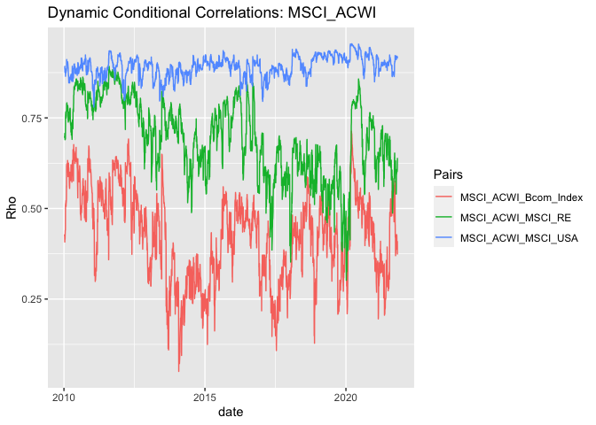

The figure above plots the DCC between the MSCI_ACWI (all country world
return) and all the other variables. One can observe that ACWI and the
MSCI_USA are strongly correlated. This is interesting, and I could argue
that US equity booms contribute strongly to the ACWI as a constituent.
But more so, the largest constituents of the ACWI, like the Euro and UK
Area are also correlated to US equity returns. At times the correlation
between commodities and the ACWI are low.

``` r
g2 <- ggplot(Rhot %>% filter(grepl("Bcom_Index_", Pairs ), !grepl("_Bcom_Index", Pairs)) ) +
geom_line(aes(x = date, y = Rho, colour = Pairs)) +
ggtitle("Dynamic Conditional Correlations: Bcom_Index")
print(g2)
```

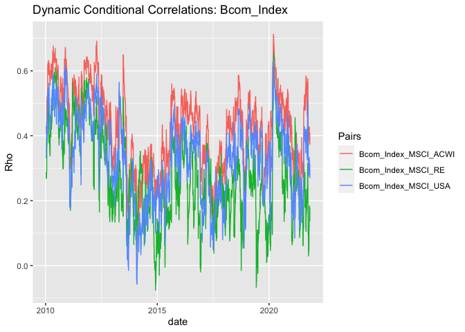

The figure above plots the DCC between the Bcom_Index (commodity index)
and all the other variables. One can observe that y-axis is a level
lower than the figure considering ACWI. This is understandable as
commodities are less correlated with equity and real estate than their
correlation with one another. The largest correlation is actually
commodities and the ACWI. This is intuitive because the countries that
stand to gain most from commdoity booms are not represented in the US
indexes I have included, such as the Middle East or Northern Europe or
Russia.

``` r
g3 <- ggplot(Rhot %>% filter(grepl("MSCI_RE_", Pairs ), !grepl("_MSCI_RE", Pairs)) ) +
geom_line(aes(x = date, y = Rho, colour = Pairs)) +
ggtitle("Dynamic Conditional Correlations: MSCI_RE")
print(g3)
```

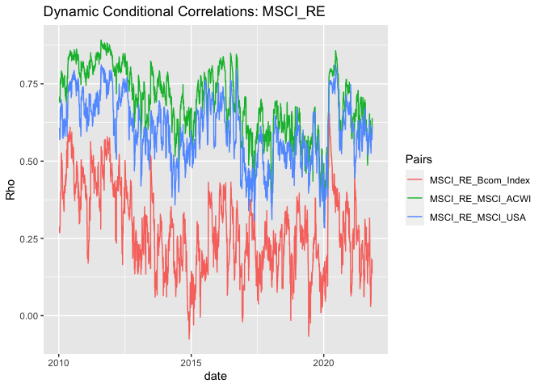

The figure above plots the DCC between the MSCI_RE (global real estate)
and all the other variables. One can observe that the MSCI_RE and
MSCI_REIT are strongly correlated. This is to be expected as they trade
in the same asset class. Intuitively again, global RE is more correlated
with global equities than with US equities.

``` r
g4 <- ggplot(Rhot %>% filter(grepl("MSCI_USREIT_", Pairs ), 
    !grepl("_MSCI_USREIT", Pairs)) ) +
geom_line(aes(x = date, y = Rho, colour = Pairs)) +
ggtitle("Dynamic Conditional Correlations: MSCI_USREIT")
print(g4)
```

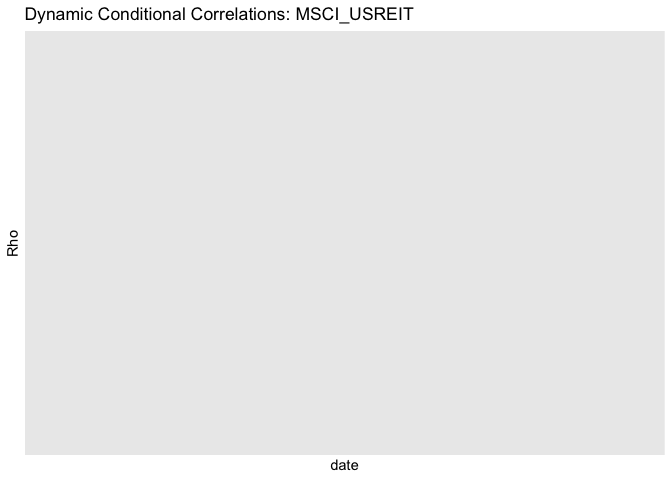

The figure above plots the DCC between the MSCI_REIT (real estate
investment trusts) and all the other variables. One can observe that the
MSCI_RE and MSCI_REIT are strongly correlated. This is to be expected as
they trade in the same asset class. Furthermore, US_REITS are strongly
correlated to US equities. This is intuitive as credit markets drive
both real estate and equities.

``` r
g5 <- ggplot(Rhot %>% filter(grepl("MSCI_USA_", Pairs ), 
    !grepl("_MSCI_USA", Pairs)) ) +
geom_line(aes(x = date, y = Rho, colour = Pairs)) +
ggtitle("Dynamic Conditional Correlations: MSCI_USA")
print(g5)
```

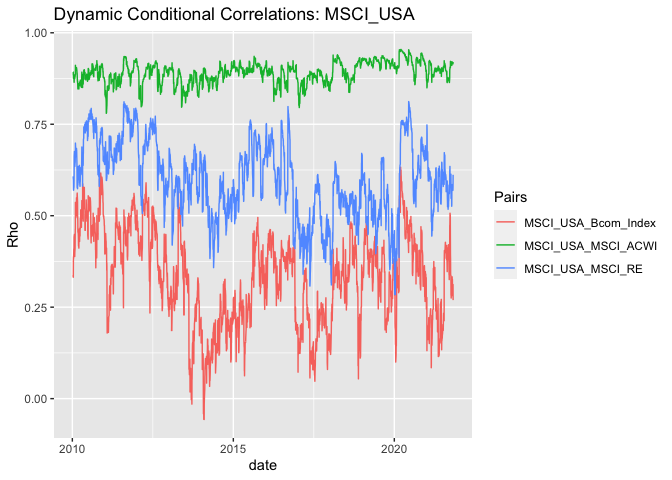

The figure above plots the DCC between the MSCI_USA (return of equity in
the USA) and all the other variables. One can observe that the MSCI_US
and the MSCI_ACWI are strongly correlated. Again, I argue this is
because the US is a big constituent in the ACWI, and the other
constituents correlate strongly with the US.

## Conclusion

My investigation has proven that the dynamic relationship of correlation
between asset classes has evolved. Some asset classes are more strongly
correlated now than before, whilst others not. My analysis focused
specifically on the last 11 years.

# Question 6 - Portfolio Construction

``` r
msci_names <- msci %>% pull(Name) %>% unique
MAA_names <- MAA %>% pull(Ticker) %>% unique

msci_wide <- msci %>% pivot_wider(names_from = Name, values_from = Price)
MAA_wide <- MAA %>% select(date, Ticker, Price) %>%
pivot_wider(names_from = Ticker, values_from = Price)

complete_index <- left_join(msci_wide, MAA_wide, by = "date")
```
